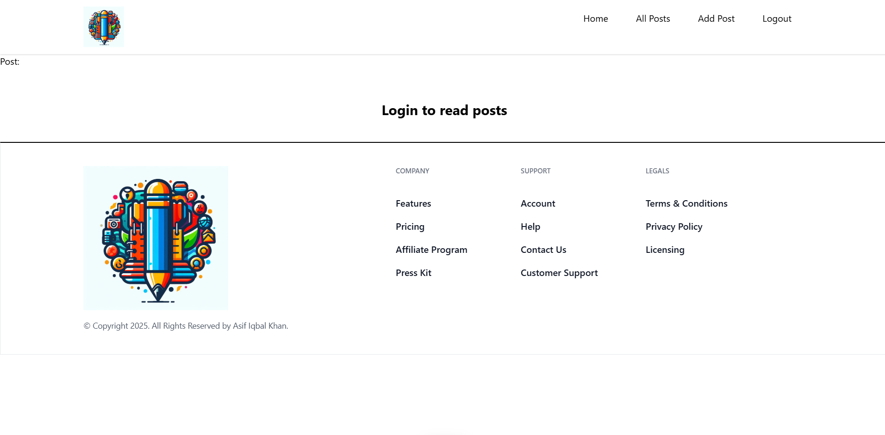

# BlogAppwrite

BlogAppwrite is a full-stack blogging platform built with React and Appwrite, providing users with a seamless experience to create, manage, and share blog posts.


## Features

- **User Authentication**: Secure user registration and login functionality.
- **Create and Edit Posts**: Rich text editor for composing and editing blog posts.
- **Responsive Design**: Optimized for various devices and screen sizes.
- **Real-time Updates**: Instant reflection of changes without page reloads.


## Installation

1. **Clone the Repository**:

   ```bash
   git clone https://github.com/ASIF-Kh/BlogAppwrite.git
   cd BlogAppwrite
   ```

2. **Set Up the Environment**:

   - Ensure you have Node.js installed (preferably version 14 or above).
   - Create a `.env` file based on the provided `.env.sample` and update it with your Appwrite credentials.

3. **Install Dependencies**:

   ```bash
   npm install
   ```

4. **Run the Application**:

   ```bash
   npm run dev
   ```

   Access the application at `http://localhost:3000` in your web browser.


## Usage

- **Register or Login**: Create a new account or log in with existing credentials.
- **Create a Post**: Navigate to the "New Post" section and utilize the rich text editor to compose your content.
- **Edit or Delete Posts**: Manage your existing posts through the dashboard.

## Contributing

Contributions are welcome! Please fork the repository and create a pull request with your enhancements or bug fixes.

## License

This project is licensed under the MIT License. See the [LICENSE](LICENSE) file for more details.

## Acknowledgements

Special thanks to the Appwrite community and all contributors for their support.

---

For more information, visit the live application: [blog-appwrite-xi.vercel.app](https://blog-appwrite-xi.vercel.app/)

  
*Screenshot of the live demo.*

---

